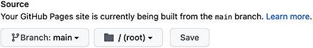

[Starter Samples](../)
# Site Install

Our helpful tips for [Yarn, Node, Python, Docker and Conda](https://model.earth/io/coders/python/).  

## Start your local webroot http-server

Run the following in your webroot folder to start your local site:

	python -m http.server 8887

To run further commands, open a new terminal window.
(The first terminal is now dedicated to hosting your webroot.)

Clone the localsite repo by running in your webroot:

	git clone https://github.com/modelearth/localsite localsite

<!--
Or run within a virtual environment. On Macs:

	python3 -m venv env
	source env/bin/activate
	python -m http.server 8887

On Windows:

	python -m venv env
	env\Scripts\activate
	python -m http.server 8887
-->

The localsite repo should now be visible at [http://localhost:8887/localsite](http://localhost:8887/localsite)  
([Other http server options](../http-server) and [VS Code issue to resolve](../http-server).)  

You can add an index.html file with the following redirect in your [webroot](http://localhost:8887/). Point at the repo you're working in the most.

	

## If you're making edits, pull down 1 or 2 additional repos 

You'll typicaly only need a couple of the repos locally when making edits.  
All the repos below are viewable at [model.earth](https://model.earth). Each repo is a subfolder. Example: [model.earth/projects](https://model.earth/projects)

We generally avoid creating branches. Make your edits in a fork, then send a Pull Request (PR). We love when you edit README.md files to help keep our TO DOs current. Add your first name where you're working and send a PR. Also send Loren an email whenever you submit a Pull Request.

To fork the repos you'll be editing, go to [github.com/modelearth](https://github.com/ModelEarth?tab=repositories), choose a repo and click the "Fork" button.  
Then in your fork, click "Code > Open with Github Desktop".  For repos you won't be editing, you can run the script below to clone.

 
Turn on GitHub Pages for any repo you fork by clicking the Settings icon, then Pages.

### Fork one or two repos you plan to edit

How to [Fork Repos](https://medium.com/@6unpnp/fork-a-github-repository-and-deploy-its-github-pages-site-d55dc53988d).  
Always fork <a href="https://github.com/ModelEarth/localsite">localsite</a> so we can review your contributions using [Github Pages](https://docs.github.com/en/pages/quickstart).  
Fork the [Home repo](https://github.com/ModelEarth/home) if you're working on our ["Everybody's Homepage" frontend](../../../home/).  
Fork <a href="https://github.com/ModelEarth/data-commons">Data-Commons</a> if you're adding data visualizations using the Google Data Commons javascript API.  
Fork <a href="https://github.com/ModelEarth/feed">Feed Player</a> if you're adding to our React Vite visual [Feed viewer](https://model.earth/feed/) and memberSense for Discord.  
Fork [Open Footprint](https://github.com/ModelEarth/profile) if you're contributing to our <a href="https://model.earth/useeio.js/footprint/">USEEIO.js International</a> ChartJS and SQL visualizations.  
Fork <a href="https://github.com/ModelEarth/realitystream">RealityStream</a> if you're contributing python to our Machine Learning visualizations.  
Fork <a href="https://github.com/ModelEarth/requests">Requests</a> if you're adding python to our image and video [Storyboard Generation](https://model.earth/data-pipeline/research/stream).  
Fork <a href="https://github.com/datascape/open-webui/actions">OpenWebUI (Datascape fork)</a> to contribute within our [Open WebUI location projects](/projects/location/) using Python and Vite.  
Fork <a href="https://github.com/ModelEarth/earthscape">Earthscape</a> if you're contributing to the our fork of [Chatbot UI](https://model.earth/earthscape/app/) using NextJS React and Supabase for Crew tools.  
Fork <a href="https://github.com/ModelEarth/data-pipeline">Data-Pipeline</a> if you're contributing Python to data prep.  

We've omitted the Community repo since it's only used for model.earth hosting. It's not needed for shared component dev.  

<!--
It's designed to serve infinite content based on parameters.  
Fork the home repo and start creating your own custom home page.  
We manage the home config setting in [Google Sheets](../../../data-commons/docs/data/) (and soon local config files).  
-->

<!-- Activate GitHub Pages so we can preview your contributions. -->

### Now you can view and edit pages locally at links like:

[localhost:8887/localsite](http://localhost:8887/localsite/)  
[localhost:8887/data-commons](http://localhost:8887/data-commons/)  
[localhost:8887/projects](http://localhost:8887/projects/)  
[localhost:8887/data-pipeline](http://localhost:8887/data-pipeline/)  
[localhost:8887/realitystream](http://localhost:8887/realitystream/)  
[localhost:8887/feed](http://localhost:8887/feed/)  

If you encounter a broken link locally, view the page at [model.earth](https://model.earth/) or clone one of the [additional modelearth repos](https://github.com/ModelEarth?tab=repositories).

## Alternative local setup using CMDs

Enter your GitHub account to include in the install and update cmds below.

<input type="text" id="gitAccount" class="textInput" style="width:210px" placeholder="YOUR ACCOUNT"  autofocus onfocus="this.select()" oninput="updateGitCmds()"> 

**Step 1.** Indicate the repos you're planning to edit and have already forked.

<!-- Also add to checkboxIds array -->

<input id="localsiteForked" type="checkbox" onclick="updateGitCmds()">Localsite 
<input id="homeForked" type="checkbox" onclick="updateGitCmds()">Home 
<input id="profileForked" type="checkbox" onclick="updateGitCmds()">Profile 
<input id="data-commonsForked" type="checkbox" onclick="updateGitCmds()">Data-Commons 
<input id="projectsForked" type="checkbox" onclick="updateGitCmds()">Projects 
<input id="requestsForked" type="checkbox" onclick="updateGitCmds()">Requests Storyboard 
<input id="realitystreamForked" type="checkbox" onclick="updateGitCmds()">RealityStream ML 
<input id="marioForked" type="checkbox" onclick="updateGitCmds()">Mario Trade Flow 

<input id="feedForked" type="checkbox" onclick="updateGitCmds()">FeedPlayer (React) 
<input id="ioForked" type="checkbox" onclick="updateGitCmds()">IO Widgets (React) 
<input id="useeio.jsForked" type="checkbox" onclick="updateGitCmds()">USEEIO.js (State Models) 
<input id="planetForked" type="checkbox" onclick="updateGitCmds()">Planet (Javascript AI) 
<input id="earthscapeForked" type="checkbox" onclick="updateGitCmds()">Earthscape (React AI) 
<input id="openWebUIForked" type="checkbox" onclick="updateGitCmds()">Open WebUI (Python AI) 
<input id="data-pipelineForked" type="checkbox" onclick="updateGitCmds()">Data-Pipeline (Python) 
<input id="community-dataForked" type="checkbox" onclick="updateGitCmds()">Community-Data 

 

**Step 2.** We recommend using [GitHub Desktop](https://desktop.github.com/) to clone your forks.  
You don't need to pull all the repos - typically just 2 or 3 (including localsite).

As an alternative to GitHub Desktop, you can run some of the following in your local webroot to pull down repos.

<textarea id="cloneCmd" class="codetext" rows="16">
git clone https://github.com/ModelEarth/localsite localsite
git clone https://github.com/ModelEarth/home home
git clone https://github.com/ModelEarth/data-commons data-commons
git clone https://github.com/ModelEarth/profile profile
git clone https://github.com/ModelEarth/projects projects
git clone https://github.com/ModelEarth/requests requests
git clone https://github.com/ModelEarth/realitystream realitystream
git clone https://github.com/ModelEarth/mario mario
git clone https://github.com/ModelEarth/feed feed
git clone https://github.com/ModelEarth/io io
git clone https://github.com/ModelEarth/useeio.js useeio.js
git clone https://github.com/ModelEarth/planet planet
git clone https://github.com/ModelEarth/earthscape earthscape
git clone https://github.com/datascape/open-webui open-webui
git clone https://github.com/ModelEarth/data-pipeline data-pipeline
git clone https://github.com/ModelEarth/community-data community-data</textarea>

## Occasionally refresh your local files

<!-- TO DO: Update this link with account entered in textbox on the current page. -->
Before you edit, sync your forks at [GitHub.com](https://github.com),  
then pull down recent updates within Github Desktop.   

Or you can run the following in your local webroot to fetch changes from the parent repos. You'll still also need to sync your fork within GitHub.com to avoid conflicts when checking in your local update. (Sync before you edit, and sync often, to avoid merge issues.)

<!--
cd localsite && git pull https://github.com/ModelEarth/localsite main && cd ../
cd io && git pull https://github.com/ModelEarth/io main && cd ../
cd data-commons && git pull https://github.com/ModelEarth/data-commons main && cd ../
cd data-pipeline && git pull https://github.com/ModelEarth/data-pipeline main && cd ../
cd projects && git pull https://github.com/ModelEarth/projects main && cd ../
cd requests && git pull https://github.com/ModelEarth/requests main && cd ../
-->
<textarea id="refreshCmd" class="codetext" rows="16"></textarea>

That's it! &nbsp;You can stop the steps here. Your updated local site should be visible at: [localhost:8887/localsite](http://localhost:8887/localsite/)

## Refresh you local repos

To avoid merge conflicts, click "Sync Fork" on the forks in your [Github Account](https://github.com/), then pull locally using GitHub Desktop or the cmds above. Or you can use the Alternative Sync commands below. 

## Create a "localsite" shortcut command to start your local web server

Optional: Create a "localsite" command so you can quickly start your local web server.

### On a PC

Save a localsite.bat file in a directory in your system's PATH environment variables, such as C:\Windows\System32.

	@echo off
	python3 -m venv env
	env\Scripts\activate
	python -m http.server 8887 -d ~/Documents/webroot

To start automatically, save a file called start_localsite.bat in the startup folder.
(To open the startup folder, press Win + R, type shell:startup, and press Enter.)

	@echo off
	cd %USERPROFILE%\Documents\webroot
	python3 -m venv env
	call env\Scripts\activate
	python -m http.server 8887 --directory %USERPROFILE%\Documents\webroot

### On a Mac

Add the following to your .bash_profile file.
Your .bash_profile file resides in /Users/[username]. 

	alias localsite="python3 -m venv env && source env/bin/activate && python3 -m http.server 8887 --directory ~/Documents/webroot"

In the command above, the tilde ~ invokes /Users/[username]  
Create a folder for your webroot if it does not already exist.  
Change /Documents/webroot to your webroot path within /Users/[username]  

<!--
Initially when no -m, clicked deny when immediatley receive the dialogue: Do you want the application “Python.app” to accept incoming network connections? 
To do: Create "webroot" folder if it does not exist yet.
-->

#### To run "localsite" when starting a mac

This is not working yet. It's opeing XCode. Please share a fix by submitting a Pull Request (PR)<!-- deleted start_localsite.sh-->

To run the above automatically when your Mac restarts, save a file called start_localsite.sh with the following:

	#!/bin/bash
	source ~/.bash_profile
	localsite

Run once to make the Script Executable:

	chmod +x ~/start_localsite.sh

Add the script to "Login Items":  
System Settings > Login Items > "+" button and add the \~/start\_localsite.sh.

## Deployment: How to Send a Pull Request

We typically use GitHub.com and GitHub Desktop to deploy changes.

1. Update your forks by clicking "Sync" for each in GitHub.com.
2. Pull with GitHub Desktip or use the "git pull" command above. If a conflict occurs, rename your local folder, pull a fresh copy and move your changed files into the local clone. This allows you to visually compare your updates in Github Desktop before commiting.
3. Commit and push your local changes up to your fork.
4. Then go to our fork in GitHub.com and click "Pull Request" to submit changes to the main parent repo.

Alternative Sync using commands:

**1.** Fetch our main upsteam repo to sync up, then move your local changes into your fork:

<textarea id="pullRequestCmd" class="codetext" rows="3">
git remote add upstream https://github.com/modelearth/data-pipeline &&
git fetch upstream && git checkout main && git merge upstream/main &&
git push origin main # Push the changes to your forked repository</textarea>

**2.** Then submit a pull request in the GitHub website, or run:

First install hub and ask it to authenticate you through your browser:

	brew install hub && hub browse

Your browser will open a page in GitHub.com
After granting access, you'll be redirected to a page displaying an authorization token to copy.

**3.** Use GitHub Desktop and click to "Commit" changes so you can review. Then click "Push origin" in the upper right. (It's easy to forget the "Push origin" step.)

**4.**  Then run a command to submit a pull request (or submit through the GitHub website):

	hub pull-request -b modelearth:data-pipeline -h [Your GitHub Account]:data-pipeline -m "Fix typo in README" -m "This pull request fixes a typo in the README file."

The 1st quote above is for a short description. The 2nd is for extra details.

 
---
 

# Detailed steps for deploying static websites

The following steps are elaborated on after this summary.  

1. [Activate a local webroot](#webroot) on your local computer for [http://localhost:8887](http://localhost:8887/)
2. Fork the [localsite repo](https://github.com/modelearth/localsite) and turn on [GitHub Pages](#github-pages).  
After a few minutes, you can view your fork at [[your account].github.io/localsite](https://modelearth.github.io/localsite)  
3. [Clone the forked repos](#clone) into your local webroot folder.
4. Deploy your updates
5. [Fetch upstream](#fetch-upstream) changes to your forked repos.
6. [Point a domain](#domain) at your repos (optional)

<section id="webroot"></section>

## 1. Activate a webroot folder on your computer

The following will allow you to launch [http://localhost:8887/localsite/](http://localhost:8887/localsite/).&nbsp; You'll view multiple repos in the same webroot.

Create a webroot folder called "webroot" in your "Documents" folder, or anywhere you prefer.
Go to the webroot folder and run the following to view pages locally at http://localhost:8887  

	python -m http.server 8887

Run the command above to restart your localhost server whenever you restart your computer.
If that doesn't work, here are more options for [activating your webroot](../webroot).

<section id="github-pages"></section>

## 2. Click the "Fork" button in the upper right of the [localsite repo](https://github.com/modelearth/localsite)

Fork both the [localsite repo](https://github.com/modelearth/localsite) and the [io repo](https://github.com/modelearth/io).
If you are making pipeline updates, also fork [data-pipeline repo](https://github.com/modelearth/data-pipeline). 
If you are generating data updates, fork [community-data](https://github.com/modelearth/community-data) and [community-forecasting](https://github.com/modelearth/community-forecasting) for timeline data. 

Activate GitHub Pages for each of your forked repos by going to "Settings > Pages" and choosing "main" (or master) then save.

IMPORTANT: DO NOT SELECT A THEME - The Jekyll theme will break the modular site integration.  

Wait a few minutes for a new GitHub Pages site to become available in the following link format:

https://[your account].github.io/io
https://[your account].github.io/localsite

<section id="clone"></section>

## 3. Clone forked repos into your webroot

Now go to [your github account](https://github.com) and clone the forked repos listed above.

To clone, click the green "Code" button followed by "Open in GitHub Desktop."

Save the clone in the webroot folder you created in step 1.  

A static page should now be visible at [http://localhost:8887/localsite/](http://localhost:8887/localsite/)  

Also clone the <a href='https://github.com/modelearth/io/'>io repo</a> into the same webroot to include the input-output widgets. [Learn more](../../../io/charts/)    

If you are making a custom page, also clone the <a href='https://github.com/modelearth/apps/'>apps repo</a>.

To redirect into a repo, you can place an index.html file in your webroot with the following redirect:  

	

## 4. Deploy your updates

Deploy your updates using GitHub. If you are not a project collaborator, GitHub Desktop will prompt you to create a project fork on GitHub. Place a pull request when your updates are ready for review.  

<!--
- <a href='https://github.com/modelearth/io'>io</a> - overview
- <a href='https://github.com/georgiadata/smartdata'>smartdata</a> - data

A 404 error will occur for the private smartdata folder if you are not a collaborator. 
-->

<!--
## 4. Update markdown pages

Add notes and links in the README.md files which are pulled into index.html pages.  

- [Bioeconomy Planner - BEA](../../bea)  
- [Industry Impact](../../industries)  
- [Localization - Places](../../places)  
-->

<!--
## 5. Update dataset layouts

Use a Google Sheet or CSV file to [prototype a list or chart](../dataset) and update [EEIO Widgets](https://model.earth/io/charts/) that load from JSON files generated by the USEEIO API.  
-->

<!--
1. [Set up crowdsourced editing](../../../crowdsource/editor) of data for lists and maps.

1. Copy the "starter" folder inside community and give it the name of your community or module.
-->

**Mac Users:** To avoid commiting your local .DS\_Store files to GitHub, you can run the following to ignore .DS\_Store files during commits forever. The .DS\_Store files will continue to set icon sizes in your local file manager.   
 
<!-- Avoid .DS_Store file creation over network connections (article from 2011, confirm this still occurs)
	https://support.apple.com/en-us/HT1629 -->
	git config --global core.excludesfile ~/.gitignore  
	echo .DS_Store >> ~/.gitignore

If you encounter the error "xcrun: error: invalid active developer path", [install the Xcode toolkit](https://ma.ttias.be/mac-os-xcrun-error-invalid-active-developer-path-missing-xcrun/) first.  

You can view hidden files by toggling Command+Shift+Dot. Note that .DS_Store will not be displayed. 
To fix conflicts, you may need delete .DS_Store files within the Github.com website.  

<section id="fetch-upstream"></section>

## 5. Fetch upstream changes to your forked repos

Occasionally merge in updates from parent repos by clicking "Fetch Upstream > Fetch and Merge" in GitHub.

Or run the script to refresh your local clones on the [io/charts](../../../io/charts/) page.

<!--
In the old days you had to do the following:

- On your forked repo: Click Compare 
- Flip the order. (Pick a third repo temporarily because if the two match a warning occurs.)
- Create pull request > Give the pull request a title 
- Create pull request (again) 
- Merge pull request (scroll down) > Confirm merge.  

[Images of steps for updating your fork](https://stackoverflow.com/questions/20984802/how-can-i-keep-my-fork-in-sync-without-adding-a-separate-remote/21131381#21131381)

-->

<section id="domain"></section>

## 6. Point a domain at your repos (optional)

You can point a domain at all the repos in your Github account with the steps below.  

- Use CloudFlare.com as a free proxy for your domain name - [setup steps](../cloudflare/) - [more about Cloudflare with GitHub](https://www.toptal.com/github/unlimited-scale-web-hosting-github-pages-cloudflare). AWS can also be used.  
- Important: If you are using the same domain for Google email accounts, avoid adding the 4 Google A records (these prevent adding the CNAME record). You'll only need to add the 5 MX records provided by Google.  
- Create a repo in your primary account matching the name of the account: [github username].github.io  
- Click settings and activate GitHub Pages for your [github username].github.io and each repo that will be an additional subfolder in your site. (This requires also doing the Special Trick below.)  
- Add your custom domain name to the root repo called [github username].github.io.  
- Special Trick: When you add a CNAME record for your domain in CloudFlare use @ to indicate the root, and point a different secondary account in Github as [secondary github username].github.io. By using a secondary GitHub username, more than one adjacent repo folder will be accessible through your primary domain. (The "localsite" repo can then be forked and shared locally with your primary site.) 

- Wait 2 to 10 minutes for new GitHub Pages site to become available.
- Activate GitHub Pages for each additional repo residing within the primary account. These can be forks from other accounts.  
- Avoid putting referenced files in your [github username].github.io root repo because it won't be the root of your site when you view on localhost.  
- Fork the "[localsite](https://github.com/modelearth/localsite/)" repo into your GitHub account if you'd like to include it's functionality in any of your sites. Turn on GitHub pages to display at YourDomain.com/localsite/  

We sometimes [use Github .submodules](../submodules/) to deploy multiple repos into a single [Cloudflare site](../cloudflare/). A super high traffic site can use Cloudflare's free CDN to avoid exceeding limits in Github.

## Ignore a newly added blank .env file

If you push a new blank .env for keys, add .env to the .gitignore.  
The use the following to remove future pushes as you add keys.  

	git update-index --assume-unchanged .env

Show it again for deploying changes:

	git update-index --no-assume-unchanged .env

## Additional Resources

<a href="/localsite/">The Localsite Framework</a> is designed to allow multiple Github repos to communicate using hash values.  

<a href="../../../apps/">View Starter Samples</a> - maps, charts, widgets.

Learn more about [JAM Stack Development](https://jamstack.org) - the process of creating fast sites using static pages with CSV files, JSON&nbsp;and&nbsp;APIs.  

Edit online using [stackedit.io](https://stackedit.io/) and [Dillinger Markdown to HTML](https://dillinger.io/)  

[AWS Amplify, and site hosting info](https://model.earth/aws/amplify/) - Azure, Firebase, GitHub Pages, Netlify and more.

---

[Edit the page above in Github](https://github.com/modelearth/localsite/blob/master/start/README.md)
